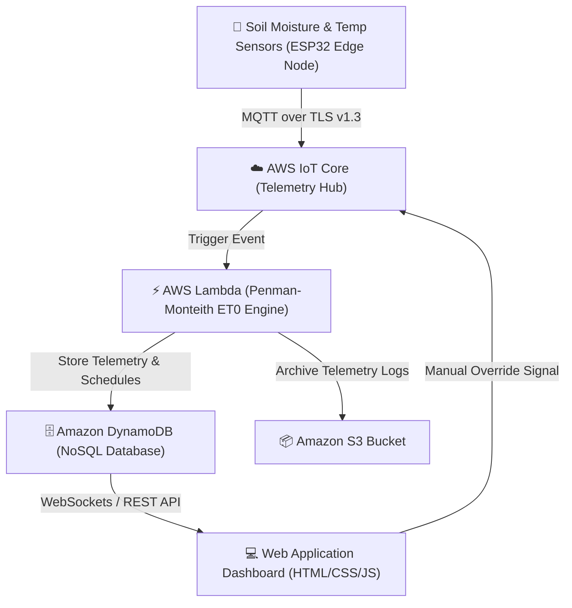

# Cloud-Based Farm Irrigation Scheduling System 🌾☁️

An advanced, production-grade precision agriculture web application built using **HTML5, CSS3 (Dark Glassmorphism Theme), and Vanilla JavaScript**. Designed as an exemplary **Cloud Computing** course project demonstrating IoT telemetry processing, serverless evapotranspiration ($ET_0$) calculation, dynamic smart irrigation scheduling, and real-time data analytics.

---

## 🌟 Key Features

1. **Homepage & Hero Dashboard**:
   - Headline: *"Smart Irrigation for Smarter Farming."*
   - Real-time live statistics counter (Schedules Saved, Completed Runs, Water Saved %).
   - Live telemetry status badge showing simulated 24ms AWS IoT Core connection latency.

2. **Soil & Weather Telemetry Monitoring**:
   - Real-time IoT sensor feed simulation (Soil Moisture %, Soil Temp °C, Solar Radiation W/m², Rain Rate).
   - Visual progress indicators and dynamic status badges for 4 farm sectors (North Rice Sector, South Wheat Sector, East Citrus Orchard, Polyhouse Microgreens).
   - Interactive Valve Controllers (Drip / Sprinkler manual override & auto-close triggers).
   - Dynamic HTML5 Canvas Charts for 24-hour Soil Moisture trend curves and Water Savings bar graphs.

3. **Smart Irrigation Scheduling Form**:
   - Fields: Farmer Name, Farm Location, Crop Type (Rice, Wheat, Maize, Vegetables, Cotton, Sugarcane, Others), Soil Moisture Level slider (0-100%), Weather Condition, Irrigation Date & Time.
   - Comprehensive JavaScript client-side input validation.
   - On submission: Displays confirmation message (`"Your irrigation schedule has been saved successfully!"`) and auto-generates a unique `Schedule ID` (e.g. `IRR-9842`).
   - Automated Cloud AI Irrigation Recommendation box based on Penman-Monteith water deficit calculation.

4. **Irrigation Tracking & Filter System**:
   - Quick lookup box by Schedule ID with live status rendering (`Scheduled`, `In Progress`, `Completed`).
   - Filterable data table (search by farmer, location, or crop type, and filter by status).
   - Persistent `localStorage` database synchronization across browser sessions.

5. **Admin Panel**:
   - Authentication modal (Demo login: `admin` / `admin123`).
   - Admin view allows updating irrigation status via dropdown or managing schedules.

6. **Cloud Infrastructure & Architecture Inspector**:
   - Live MQTT payload stream viewer (`AWS IoT Core` JSON format).
   - Simulated AWS Lambda serverless execution logs and DynamoDB state persistence.

7. **Farmer Testimonials, About & Contact Sections**:
   - Testimonials grid from real agricultural users.
   - Architectural explanation of Edge IoT Sensors -> AWS IoT Core -> Lambda ET0 Engine -> DynamoDB -> Web Dashboard.
   - Interactive contact form with submission alert feedback.

8. **Built-in AI Master Prompt Generator**:
   - Provides ready-to-copy prompts tailored for full project builds, technical project reports, viva exam defense Q&As, and AWS backend code integrations.

---

## 🏗️ Cloud Computing System Architecture



---

## 🚀 How to Run the Project

1. Download or clone this project folder.
2. Open `index.html` in any modern web browser (Google Chrome, Mozilla Firefox, Microsoft Edge, Safari).
3. No external servers or build tools required! The application is self-contained with pure HTML, CSS, and JS.

---

## 🤖 Master AI Prompt for Course Submission & Extension

You can use the following master prompt in ChatGPT, Claude, or Antigravity to extend or generate report documentation for this project:

```text
Act as a Senior Cloud Solutions Architect & Full-Stack Developer. Build a comprehensive, production-ready "Cloud-Based Farm Irrigation Scheduling System" web application for a Cloud Computing course project.

REQUIREMENTS:
1. Frontend Stack: HTML5, CSS3 (Dark Emerald Glassmorphism, Responsive CSS Grid/Flexbox), and Vanilla JavaScript (ES6+).
2. Architecture Simulation:
   - Real-time IoT sensor telemetry feed (Soil Moisture %, Soil Temp, Solar Radiation, Air Humidity).
   - Serverless Cloud engine calculating Evapotranspiration (ET0 Penman-Monteith equation).
   - Cloud Telemetry Simulator showcasing AWS IoT Core MQTT payload JSON streams, AWS Lambda trigger logs, and DynamoDB database records.
3. Features:
   - Hero section with key statistics and live connection status.
   - Farm Sector Grid with individual valve toggles (Drip/Sprinkler) and soil moisture progress indicators.
   - Smart Irrigation Scheduling Form with client-side validation, localStorage persistence, and auto-generated Schedule IDs.
   - Searchable & Filterable Schedule Tracker (by Crop Type, Location, Status).
   - Admin Panel with login authentication to manage, update, and complete irrigation tasks.
   - Farmer Testimonials, About, and Contact sections with submission feedback.
   - Dynamic Canvas visual charts for 24-hour soil moisture curves and water savings metrics.
```
